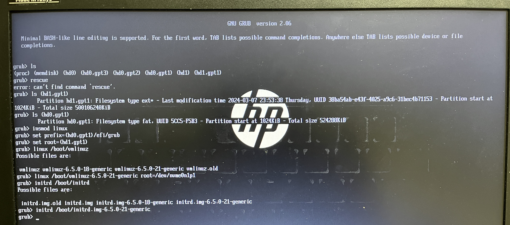

<!--
class: slides
-->

# grub install battle

(ぐらぶいんすとーるばとる)

<!--
_class: title
-->

---

## 自己紹介

- H1rono_K
- Rustacean
- 最近はNixが気になり
- GitHub: [H1rono](https://github.com/h1rono)
- Twitter: [@H1rono_K](https://twitter.com/H1rono_K)
- [最近ようやくOAuth 2.0がほんのちょっとわかりました](https://github.com/H1rono/traq-oauth.rs)


---

## 注

- H1ronoはLinux初心者です
- H1ronoは特別な訓練ないし教育を受けていません
- H1ronoの手元にあるノートPCで検証しています
    - それ以外の環境では検証していません

---

## BIOSを開きたくない

デュアルブート生活でこう思う日々

---

## そうだ、grubをいじろう

という話をします

---

## grubって何?

> [GRUB - ArchWiki](https://wiki.archlinux.jp/index.php/GRUB) より
>
> ---
>
> [GRUB](https://www.gnu.org/software/grub/) (GRand Unified Bootloader) は[ブートローダー](https://wiki.archlinux.jp/index.php/%E3%83%96%E3%83%BC%E3%83%88%E3%83%AD%E3%83%BC%E3%83%80%E3%83%BC)です。
> 現在の GRUB は **GRUB 2** とも呼ばれています。

---

## ブートの流れ

BIOS/UEFI → ブートローダー → カーネル

grubはLinuxで採用されているブートローダー

- [【Linux】OSブートの仕組み #Linux - Qiita](https://qiita.com/dan-go/items/4b532133495325ca7388)

---

## 作りたい構成


---

## grubの設定方法

基本的なやり方

1. `/etc/default/grub`をいじる
2. `update-grub`ないし`grub-mkconfig -o /boot/grub/grub.cfg`

grubのブートエントリに他のOSを追加する場合:

- `/etc/default/grub`に`GRUB_DISABLE_OS_PROBER=false`を入れる
- `update-grub`の前に、エントリに追加したいOSのパーティションをマウントしておく

---

## 完成イメージ

grubからOSを選択できるようにしたい


(ここではLinux Mint + Arch Linuxでできているが、Ubuntuでやりたかった)

---

## パーティション構成

```
/dev/sda
    /dev/sda1:      EFI System Partition
    /dev/sda2:      Ubuntu
/dev/nvme0n1
    /dev/nvme0n1p1: Arch Linux
```

EFI System Partition(以下ESP)をOS間で共有できるように

---

## 手順 (やってない)

1. パーティションを割る
2. Ubuntuを入れる(ESPを指定して)
3. Arch Linuxを入れる
    1. archiso環境でESPをフォーマット
    2. [私的Arch Linuxインストール講座](https://zenn.dev/ytjvdcm/articles/0efb9112468de3)などに従って入れる(Ubuntuは触れない)
    3. ESPは`/boot`にマウントする
4. 入ったArch LinuxからUbuntuのfstabを編集(ESPフォーマットの影響)
    1. `blkid`でESPの情報を確認して反映させる
5. Ubuntuのパーティションをマウント
6. `os-prober`が入っていることを確認
7. `/etc/default/grub`を編集
8. `update-grub`(無ければ`grub-mkconfig -o /boot/grub/grub.cfg`)

---

## こうしたらいいのかも？な手順 (未検証2)

1. パーティションを割る
2. Ubuntuを入れる(ESPを指定して)
3. Arch Linuxを入れる
    1. ESPをフォーマットしない
    2. `arch-chroot`環境でESPを認識できるように頑張る(いい感じに`mount`)
    3. Ubuntuのパーティションをマウント
    4. `/etc/default/grub`を編集
    5. その上で`grub-install`, `grub-mkconfig`
    6. Ubuntuのfstabを確認
4. BIOSからブートオーダーを変える(Archで入れたものを最優先に)

---

## そうやればよかったんだ！な手順

1. パーティションを割る
2. Ubuntuを入れる(ESPを指定して)
3. Arch Linuxを入れる
    1. ESPをフォーマットしない
    2. `grub-install`, `grub-mkconfig`**しない**
4. UbuntuからArchのパーティションをマウント
5. `update-grub`する
6. 再起動して確認

---

## 出来上がったものがこちら


---

## 注2

- fstabの修正忘れに注意
- 失敗しすぎるとLive USBが壊れます(1敗)
    - ディスクも破壊と再生を繰り返すため消耗します
- `apt upgrade`で時々`update-grub`が行われるため、油断するとgrubメニューからArchが消えます
    - fstabに書きましょう

---

## fstabが間違っていると... (1)

grub shellに入ります



これは慣れすぎた操作ログ　キーボードはUS配列と認識されてるので注意

---

## fstabが間違っていると... (2)

grub shellの次はemergency modeが出てきます


ここでfstabを直して(`vim /etc/fstab`など) rebootしましょう

---

## ref

- [EFIシステムパーティションを破壊した時の対処 #ubuntu18.04LTS - Qiita](https://qiita.com/Rooter-edi/items/ed6bac7520294e3dd039)
- [第743回　Ubuntuの標準ブートローダーであるGRUBを改めて見直す | gihyo.jp](https://gihyo.jp/admin/serial/01/ubuntu-recipe/0743)
- [第746回　update-grubの仕組みを使ってUbuntuのGRUBをさらにカスタマイズする | gihyo.jp](https://gihyo.jp/admin/serial/01/ubuntu-recipe/0746)
- [ブートローダー GRUB 設定｜PCで遊んだ日々の備忘録](https://www.fuukemn.biz/page13.html)
- [fstab - ArchWiki](https://wiki.archlinux.jp/index.php/Fstab)
- [GRUB - ArchWiki](https://wiki.archlinux.jp/index.php/GRUB)
- [GRUB rescue コマンドで起動しないブートローダーを修復する](https://segakuin.com/linux/grub.html#google_vignette)

---

## 次回

Raspberry PiをPXEサーバー化 (やってない)
i3wm何もわからない
